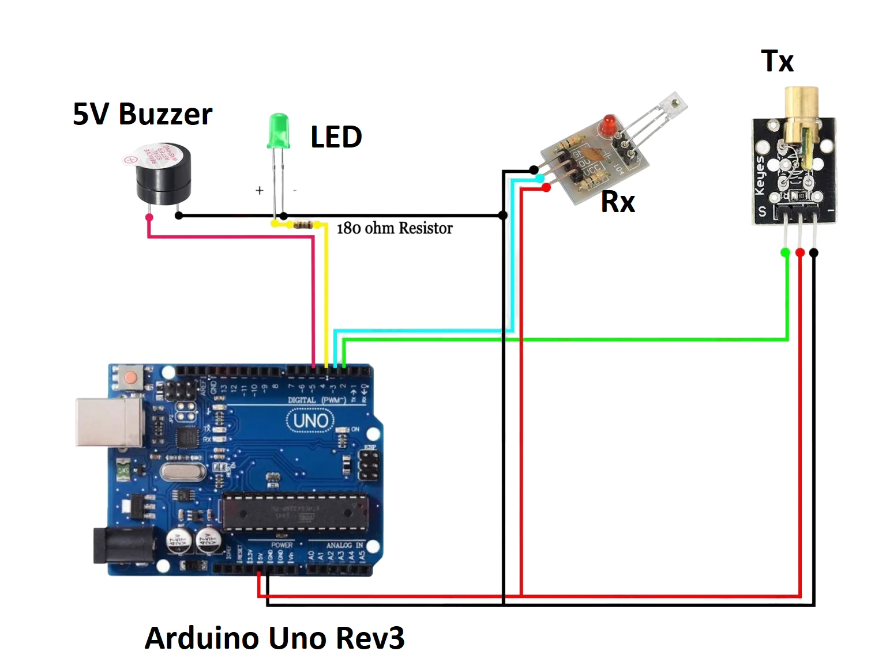

# Laser Sensor Security System  
Created by Faranux Team

## 📖 Overview
This project implements a laser-based security system using an Arduino Uno. It uses a laser transmitter and receiver module to detect beam interruptions. When the beam is broken (e.g., by an intruder), the system triggers an alarm via a buzzer and a visual LED indicator. It also reports status messages to the Serial Monitor.

## ✨ Features
- Real-time detection of laser beam interruptions  
- Visual feedback through an LED  
- Audible alert through a buzzer  
- Serial Monitor status logging  
- Simple, effective, and low-cost security solution

## 🧰 Components Required
| Component                | Quantity |
|--------------------------|----------|
| Arduino Uno Rev3         | 1        |
| Laser Transmitter Module | 1        |
| Laser Receiver Module    | 1        |
| LED (any color)          | 1        |
| 180Ω Resistor            | 1        |
| 5V Active Buzzer         | 1        |
| Jumper Wires             | Several  |
| Breadboard (optional)    | 1        |

## 🛠️ Pin Configuration
| Component | Arduino Pin |
|-----------|-------------|
| Laser Tx  | D2          |
| Laser Rx  | D3          |
| LED       | D12         |
| Buzzer    | D5          |


## 🔌 Circuit Diagram


> *Make sure to align the laser beam directly to the receiver sensor. The LED should be connected with a 180Ω resistor in series.*

## ⚙️ How It Works
1. The laser transmitter continuously emits a beam to the receiver.
2. If the beam reaches the receiver:
   - The LED is **ON**
   - The buzzer is **OFF**
   - Serial Monitor prints: `Secure - Beam connected`
3. If the beam is broken (e.g., someone passes through):
   - The LED turns **OFF**
   - The buzzer turns **ON**
   - Serial Monitor prints: `ALERT! Beam interrupted!`


## Installation
1. Clone this repository:
```bash
git clone https://github.com/Ishimwe-William/faranux.git
```
2. Connect the components according to the circuit diagram
3. Upload the provided Arduino code to your Arduino Uno
4. Open Serial Monitor (baud rate: 9600)
5. Power up the system

## Serial Monitor Output
The system provides real-time status updates through the Serial Monitor:
```
Laser Security System Initializing...
System Armed and Ready!
Status: Secure - Beam connected
Status: ALERT! Beam interrupted!
```

## Usage
The system will start working immediately after powering up:
- Green LED indicates system is armed and functioning
- Buzzer will sound when the laser beam is interrupted
- Monitor system status through Serial Monitor

## Troubleshooting
| Problem | Solution |
|---------|----------|
| LED always OFF | Check LED polarity and 180Ω resistor |
| Buzzer not working | Verify 5V power connection |
| Laser not detecting | Align Tx and Rx modules properly |

## Safety Notes
- ⚠️ Do not point the laser beam at eyes
- ⚠️ Ensure proper voltage levels for all components
- ⚠️ Double-check connections before powering up
- Keep laser path clear of reflective surfaces

## Contributing
1. Fork the repository
2. Create your feature branch
3. Commit your changes
4. Push to the branch
5. Create a new Pull Request

## License
This project is open-source and available under the MIT License.

## Authors
- Faranux Team

## Version History
- (2025-08-01): Initial release